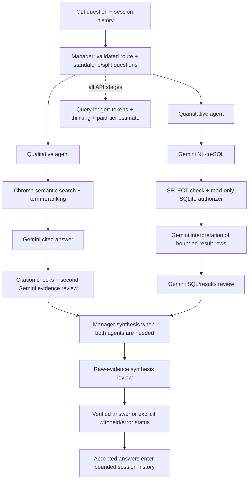

# Unit 2 Capstone: Multi-Agent RAG with Gemini

A Python 3.11 CLI that answers enterprise documentation and SQLite questions using a manager,
two specialist agents, output validation and query-level token accounting. It includes **all five
Silver/Gold stretch goals**: conversation history, a second qualitative reviewer, agent unit tests,
workflow integration tests and measured token optimisation.

**Provider adaptation:** the assignment originally specifies Claude Sonnet 4.6 only. The instructor
explicitly approved keeping Gemini because both the instructor and students have free access.
This version consistently uses configurable `gemini-3.5-flash-lite`; it cannot satisfy the literal
Claude-only clause without that agreed exception. See [the original assessment](docs/assessment.md)
for what was already working and what was missing.

## Architecture



Single-agent answers are released after their specialist review without an extra synthesis call.
Failures are withheld before the CLI shows a candidate answer. Every generation, review and
repair is included in the query ledger. Read [the file-by-file guide](docs/file-guide.md) and
[the student-oriented design explanation](docs/design.md) for the complete implementation map.

## Setup and usage

Use Python 3.11. For a fresh checkout on Windows:

```powershell
python -m venv .venv
.\.venv\Scripts\Activate.ps1
python -m pip install -r requirements.txt
# Only for a fresh checkout without your own .env:
Copy-Item .env.example .env
```

Edit `.env` to set `GEMINI_API_KEY`. Keep an existing credential file. `.env` is ignored; the
example contains no real secret. On macOS/Linux activate with `source .venv/bin/activate` and
copy the template with `cp .env.example .env` if needed.

```powershell
python smoke_test.py
python setup_db.py
python ingest.py
python main.py
```

`setup_db.py` keeps an existing database; it never deletes it. The original teaching database is
included. `ingest.py` builds the ignored runtime index in `data/index`, using the same local
`all-MiniLM-L6-v2` model for document and query embeddings. The first embedding load may download
model files. Re-run ingestion after changing source documents.

The CLI accepts `exit`/`quit`, `/reset` to clear memory, and reference follow-ups. For example:

```text
What was North America's Q4 2025 revenue?
How many units did that region sell in that quarter?
```

Single-query mode supports scripting:

```powershell
python main.py --query "Explain the code review process"
python main.py --query "What is our customer churn rate?" --json
```

The default request interval is seven seconds within one process. Increase
`GEMINI_REQUEST_INTERVAL_SECONDS` in `.env` if your account hits free-tier rate limits. A mixed
query makes more calls and can take about a minute. Independent concurrent processes share
provider quotas; run the live evaluation and optimisation sequentially.

## Tests and live evidence

```powershell
# Offline agent/validator/workflow/SQLite/Chroma regressions; no Gemini calls:
python -m unittest discover -v
# Explicitly uses your real Gemini key and appends actual query usage:
python scripts/evaluate.py --live
python scripts/evaluate.py --live --optimisation
# Computes independent expected-result checks and token savings; no API calls:
python scripts/report.py
```

The offline suite uses scripted model responses and real temporary SQLite/Chroma databases.
Its fake responses are **not** counted as submission evidence. Actual scenario answers, raw
evidence, SQL, flags and matching ledger query IDs are saved in
[live_queries.json](docs/evidence/live_queries.json). Earlier genuine failures are preserved in
[initial_live_queries.json](docs/evidence/initial_live_queries.json). The latest report independently
checks required document facts and exact database results, including 4/12 snapshot churn,
Q4 regional revenue, department averages and the reference follow-up's 52 units.

Local verification: **43 offline tests passed**; **11/11 live scenarios passed** validation and independent evidence checks. Both mixed workflows, the North America reference follow-up, and the unsupported-topic refusal were verified. All three paired optimisation scenarios preserved the required facts in both arms.

The submitted [tokenomics_log.jsonl](tokenomics_log.jsonl) preserves your historical entries and
adds more than ten real user-query runs. New records use `schema_version: 2`, group all API
stages by `query_id`, and distinguish accepted, flagged and error outcomes. Original stage-level
records retain their original fields and cost assumptions; they are excluded from new-cost analysis.

## Trust-but-Verify

These are actual Gemini outputs and decisions from the saved live transcripts, not illustrative
mock responses. The full records supply exact outputs, flags, SQL and query IDs.

| Submitted query | What Gemini returned | Validation / independent check | Decision and why |
|---|---|---|---|
| “Explain the code review process” | “All production code updates to have at least two approving reviews from peer engineers before merging into main branches [Source 1].” Also required parameterized SQL and SAST/dependency scans. | Citation resolved to `security_policy.txt`; the second reviewer accepted. Independently checked the source's code-review section. | Accepted after retrieval correction. The initial two semantic hits excluded the security policy and returned a refusal. Term-aware reranking now includes the document containing the answer. |
| “What is our customer churn rate?” | “the customer churn rate is 0.3333 (or approximately 33.33%)” with `[SQL result]`. | SELECT calculated non-null `churn_date` customers divided by all customers. Read-only execution and reviewer passed; independently counted 4 churned of 12. | Accepted **as snapshot churn**. A monthly/quarterly cohort churn rate would require cohort start dates, which this dataset lacks. A plausible percentage alone was not enough to trust it. |
| “Analyse our sales performance and recommend policy changes based on our customer success strategies” — initial run | SQL used `LEFT JOIN customers ON 1=1` and `AVG(CAST(churn_date AS REAL))`. The interpretation claimed October 2025 revenue of **1,440,000** and a “churn rate” of **2025.75**. | SQL executed, but the independent reviewer flagged the Cartesian join and meaningless date-as-rate calculation. This demonstrates why SQL success is not evidence of analytical correctness. | Rejected and withheld. Independently recomputed October revenue as **120,000**. Split the manager's request into monthly sales metrics and documented customer strategies, and added explicit no-unrelated-joins guidance. The corrected SQL aggregates `sales` directly. |
| “How does our employee satisfaction compare to industry standards and what policies might impact this?” | Department averages: CX **3.67**, Engineering **4.33**, Product **4.05**, Sales **4.07**, Security **4.55**; “Comparisons to industry standards and benchmarks are missing from the provided data.” | SQL values match independently computed department averages. The final review accepted the explicit missing-benchmark limitation. The initial run also exposed the nonexistent column `satisfsaction_score`, which never reached interpretation. | Accepted the internal measurements and uncertainty. Declined to infer an industry comparison or causal policy effect from nonexistent benchmark/linkage data; syntax/schema errors now have one bounded, revalidated repair attempt. |
| “How many units did that region sell in that quarter?” after North America Q4 2025 revenue | The manager resolved the reference to **North America, Q4 2025** and SQL returned **52 units**. | Checked explicit region/year/date filters and independently summed 12 + 40 units. | Accepted: session memory resolved the question while fresh SQL supplied the facts. |
| “What is our policy for bringing pet dragons to work?” | “I cannot find this information in the provided documents.” | The exact refusal passed the reviewer because no source establishes such a policy. | Accepted the refusal; invented policy would have been withheld. |

The sales cross join is the required case where a real model output was **not immediately
trusted**. Its SQL was legal and executable but analytically wrong; checking the evidence prevented
a confident wrong answer from being released. The preserved earlier report also records genuine
quota errors and reviewer failures. A second model can over-reject or miss errors, so offline guards,
expected-result checks and human review remain necessary.

## Tokenomics optimisation

The concrete optimisation reduces generated/reviewed retrieval context from up to **five chunks /
1,500 words** to **two chunks / 700 words**. Both experiment arms use the same model, prompts,
term-aware candidate ranking and evidence reviewer; only the context budget changes. Our corpus
has three chunks, so the baseline actually retrieves three, not five.

The initial attempt to cut purely semantic hits missed the code-review fact. We corrected ranking
before accepting the optimisation. Quality checks require the security rules, peer-review/security
checks, and complaint handling/refund/escalation facts in both arms, in addition to reviewer acceptance.
The paired real calls are in [optimisation.json](docs/evidence/optimisation.json), and independently
computed totals are in [report.json](docs/evidence/report.json).

| Across the three paired questions | Baseline | Optimised |
|---|---:|---:|
| Input tokens (all stages) | 11,090 | 8,172 |
| Output tokens (all stages) | 963 | 907 |
| Thinking tokens | 0 | 0 |
| Total tokens | 12,053 | 9,079 |
| Required facts and reviewer checks | 3/3 passed | 3/3 passed |

**Measured reduction: 26.31% fewer input tokens and
24.67% fewer total tokens.** The submitted log preserves
23 original stage entries and now includes
35 new query-level audit entries (including smoke, flagged/error,
scenario and experiment runs). These historical counts describe the saved evidence at completion;
future runs append more records.

These measurements establish preserved answer quality for the three tested questions and this
small corpus, not every possible corpus/query. Adding reviewers increases total system work;
the experiment measures savings within the reviewed system, not a claim that it is cheaper than
the original scaffold that lacked those reviews.

The logger estimates standard paid-tier costs using **$0.30 input / $2.50 output per million tokens**
for `gemini-3.5-flash-lite`, including thinking in billable output. These were checked against
[Google's pricing](https://ai.google.dev/gemini-api/docs/pricing) on 2026-10-09; the model code was
checked in [Google's model catalog](https://ai.google.dev/gemini-api/docs/models). **Free-tier
charges can be zero.** The estimate is an accounting comparison, not your bill. Unknown model
prices or missing usage stay unknown. If changing models, configure both rate overrides in `.env`.

## Completion checklist

The following applies to the explicitly agreed Gemini adaptation of the supplied rubric.

- [x] Python 3.11 virtual environment and frozen requirements.
- [x] Document chunking/embedding and Chroma retrieval.
- [x] Manager classification, routing and mixed-response synthesis.
- [x] Grounded, cited qualitative generation with explicit refusal.
- [x] NL-to-SQL, SQLite execution and pre-execution SELECT validation.
- [x] Validation before release of generated answers; structured routing/review contracts checked.
- [x] Query-level input/output/thinking tokens and cost estimates.
- [x] Consistent configured Gemini model; explicit exception to original Claude-only wording.
- [x] Environment-based key, untracked `.env`, safe example configuration.
- [x] CLI supports qualitative, quantitative and mixed questions.
- [x] Real Trust-but-Verify examples with outputs, flags and decisions.
- [x] Submitted token log with more than ten real query runs.
- [x] Silver: conversation history and follow-up resolution.
- [x] Silver: separate qualitative evidence reviewer call.
- [x] Gold: unit tests for manager, qualitative, quantitative and validator.
- [x] Gold: multi-agent workflow integration tests.
- [x] Gold: measured token optimisation with unchanged required facts in the tested pairs.

The fictional source documents remain source evidence, including their original references to
Claude in engineering onboarding. The executable application is the Gemini adaptation. Industry
benchmarks, cohort churn and causal policy analyses remain unavailable in the supplied dataset.
